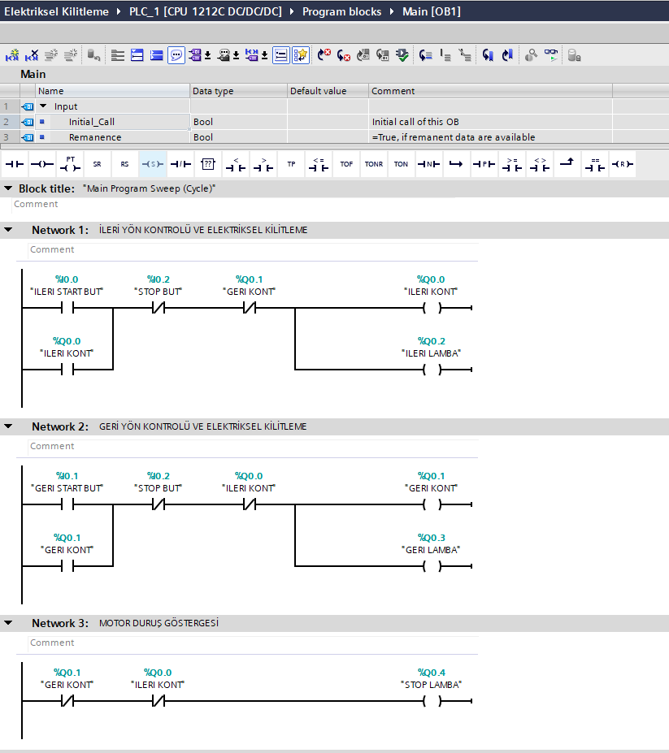

# PLC Motor İleri-Geri Kontrolü ve Elektriksel Kilitleme

Bu projede Siemens S7-1200 PLC ve TIA Portal V18 kullanılarak üç fazlı asenkron motorun ileri-geri yönde kontrolü ve elektriksel kilitleme mantığı Ladder (LAD) dilinde gerçekleştirilmiştir.

## Kullanılan Teknolojiler

- Siemens S7-1200 PLC
- TIA Portal V18
- Ladder (LAD)
- Elektriksel kilitleme

## Program Yapısı

### Network 1 – Motor İleri Yönde Çalışma

İleri Start butonuna basıldığında ileri kontaktör devreye alınır ve kontaktör kontağı kullanılarak mühürleme yapılır. Geri kontaktörün aynı anda devreye girmesini önlemek amacıyla elektriksel kilitleme uygulanmıştır.

### Network 2 – Motor Geri Yönde Çalışma

Geri Start butonuna basıldığında geri kontaktör devreye alınır ve mühürleme yapılır. İleri kontaktörün aynı anda devreye girmesini önlemek amacıyla elektriksel kilitleme uygulanmıştır.

### Network 3 – Durum Lambası

Motorun ileri veya geri yönde çalışmadığı durumda Stop lambası aktif olur. İleri ve geri çalışma durumları ayrıca ilgili çıkış lambaları üzerinden gösterilir.

## Proje Dosyası

Repository içerisinde TIA Portal V18 ile oluşturulmuş `.zap18` proje arşivi bulunmaktadır.

## Ladder Diyagramı

Programın Ladder diyagramı aşağıda gösterilmektedir.

